## Welcome to the Bob / Watsonx Orchestrate !

You will learn how to:
 - Install and configure watsonx Orchestrate ADK to interact with a Watsonx Orchestrate / wa4z instance
 - Configure Bob MCP servers to work with the wa4z instance from Bob
 - Create an agent using and a simple tool with Bob in watsonx Orchestrate
 - Load these agent and tool in the wa4z instance and run them.

### Prerequisites: Install wxo ADK

#### Connect the wa4z instance 

Connect your openvpn:

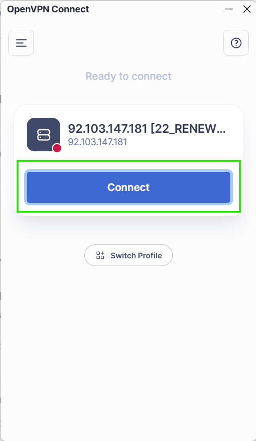

Another DNS server has to be added to resolve the wa4z instance:

For windows:

```powershell
Add-DnsClientNrptRule -Namespace ".ocpgray.edu.ihost.com" -DnsSecEnable -NameServers ("10.3.34.1")
```

For MAC ( NOT TESTED):
```bash
sudo mkdir -p /etc/resolver
echo "nameserver 10.3.34.1" | sudo tee /etc/resolver/ocpgray.edu.ihost.com
```

Open your browser and type this url:

```url
https://cpd-watsonx.apps.ocpgray.edu.ihost.com
```

select "OpenShift authentification" and click Continue:

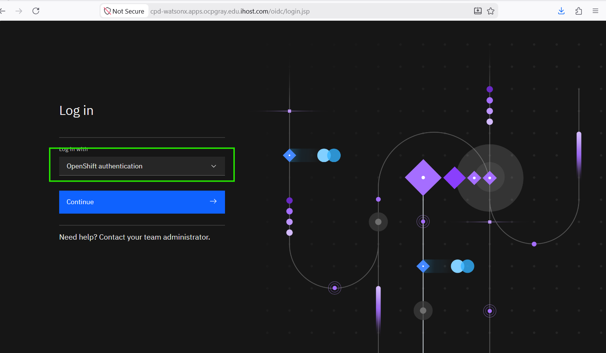

then select "ldapShowcase":

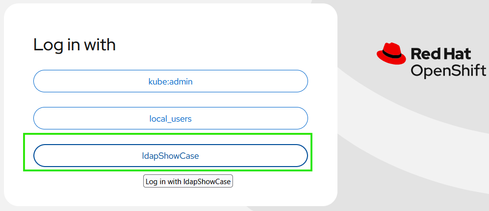

type the provided username / password and click login:

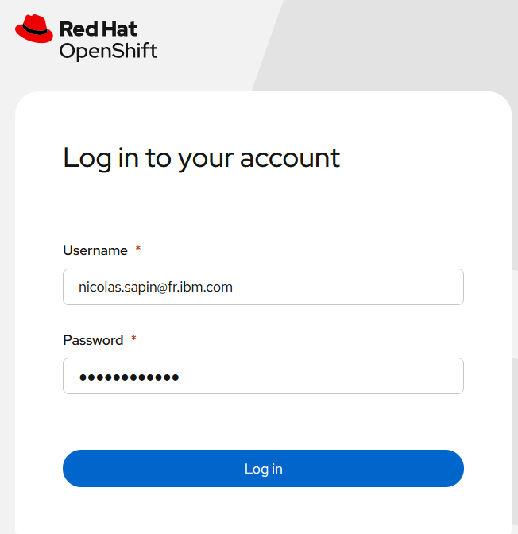

Select instances the wxo:

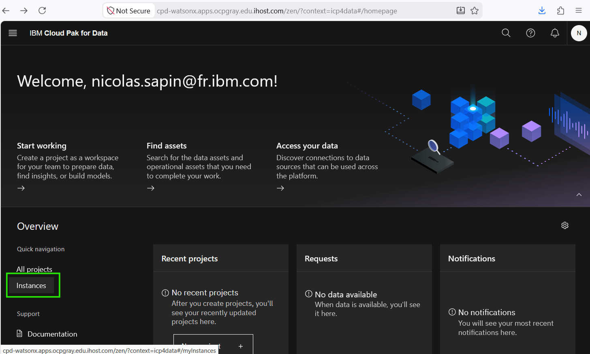

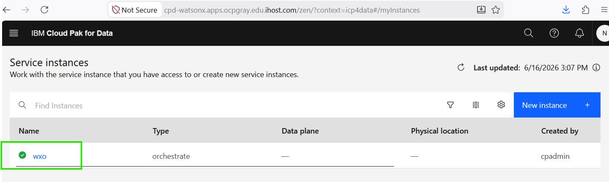

then "Open" and you will be connected the watsonx orchestrate instance:

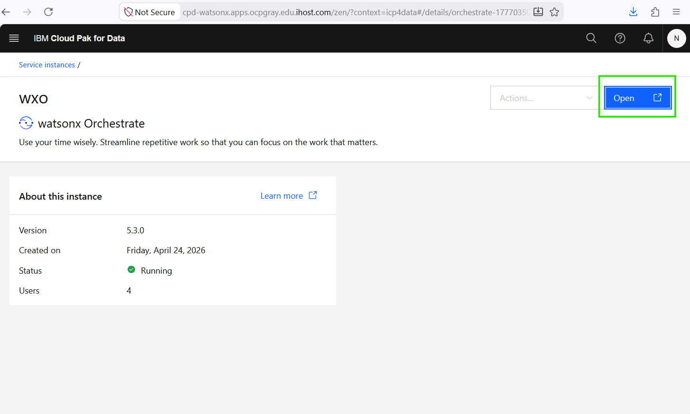

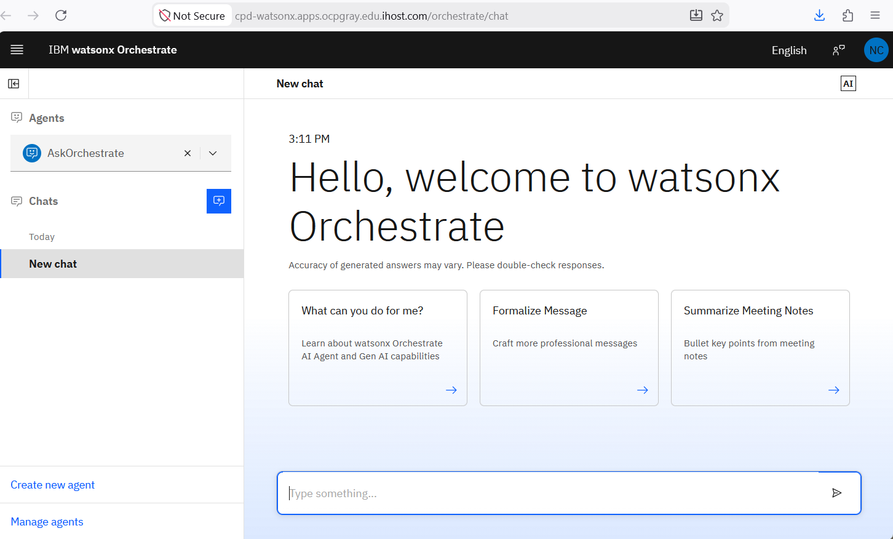

#### Install uv (if not already installed)

Have a look at [uv installation instructions](https://docs.astral.sh/uv/getting-started/installation/) or directly follow these instructions depending on your operating system.

**Windows:**
To install uv on Windows, open PowerShell or Command Prompt and run:
```powershell
powershell -ExecutionPolicy ByPass -c "irm https://astral.sh/uv/install.ps1 | iex"
```


**Mac:**
To install uv on Mac, open Terminal and run:
```bash
curl -LsSf https://astral.sh/uv/install.sh | sh
```


After installation, verify uv is installed correctly by running:
```bash
uv --version
```


#### Install ADK

- Open New Window (Ctrl + Shift + N) within Bob IDE to start from a clean workspace.

- Create and Open a new folder for your project (name it properly, here we use the folder named environment-setup just as an example)

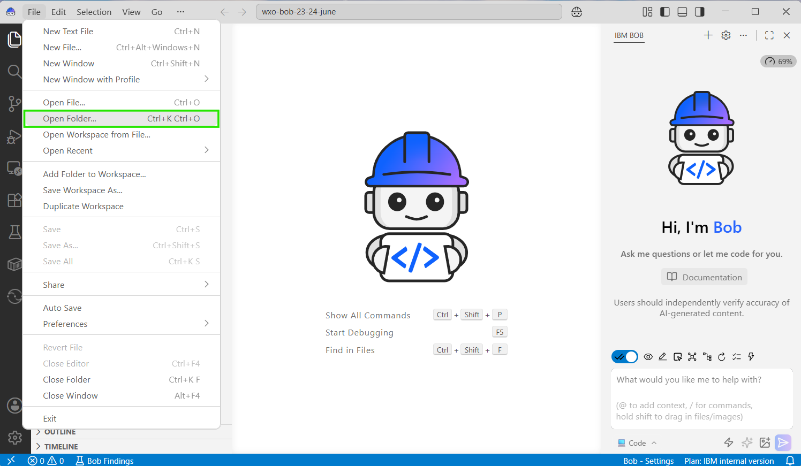

Here the folder is "wxo-bob-23-24-june":

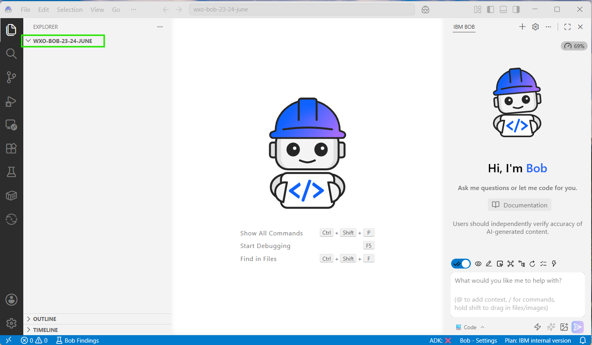

 - Click the search bar on the top and select Show and Run Commands
 
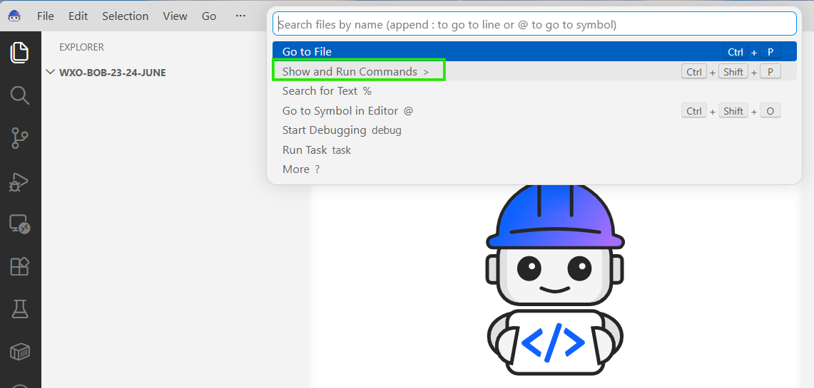

 - Type in “create” and select Python: Create Environment…
 
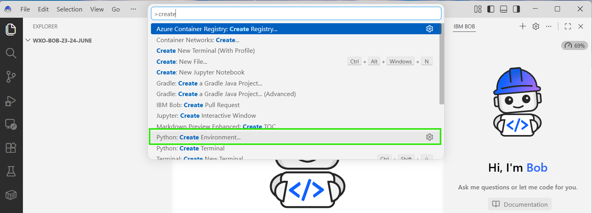

 - Select Venv if given some options (depends on what you have installed to your computer)
 
 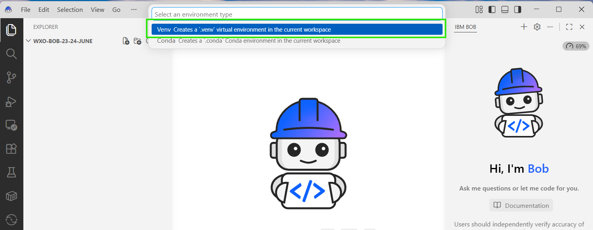

 - Select your Python installation, 3.11.x – 3.13.x (3.12.9 recommended - the current ADK requires Python 3.11 or later; anything older than 3.11 is not supported for installation)
 
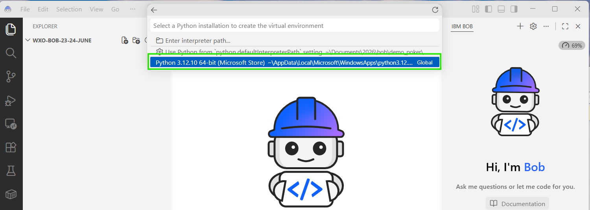

The Python virtual environment will be installed and you’ll see the .venv folder under your project folder in a couple of seconds.

 - Click the Extensions icon from the menu bar on the left, search for “watsonx” and click Install on the watsonx Orchestrate ADK extension

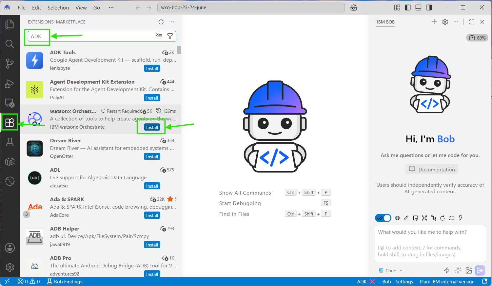


This will install the extension (note that the extension is still in preview)

Now that you have the wxO ADK extension installed, you can see the ADK information on the bottom right of Bob IDE window.

Hoover the ADK: ❌ – **BUT DO NOT INSTALL THE ADK VIA THE UI** (We want to install a specific version of the ADK because the latest version has a bug related to watsonx Orchestrate on-prem that we want to avoid.)

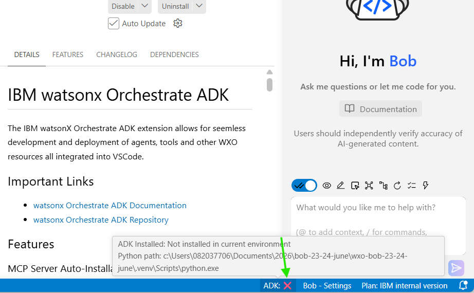

Open a terminal. The Python virtual environment you recently created should now be activated.:

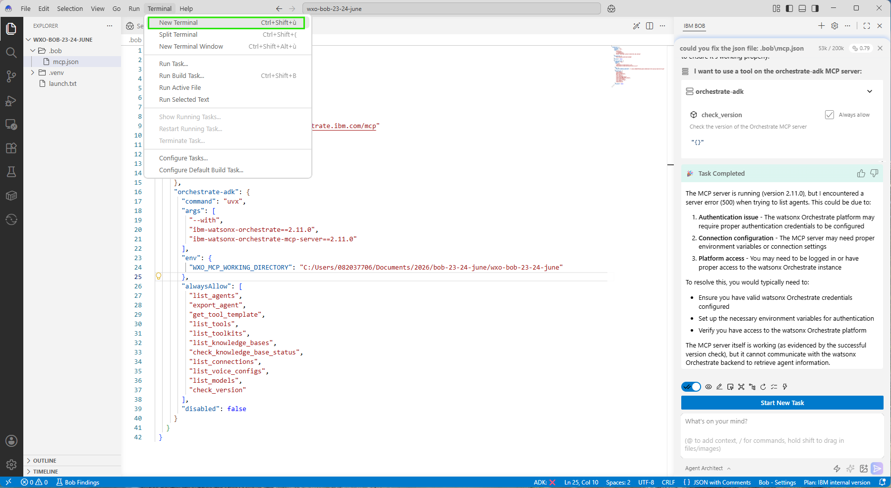

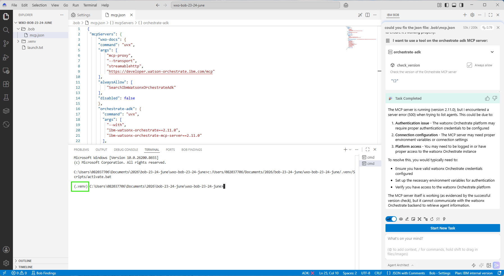

Install the ADK python package with:

```bash
pip install ibm-watsonx-orchestrate==2.6.0 ibm-watsonx-orchestrate-clients==2.7.0 ibm-watsonx-orchestrate-core==2.7.0
```
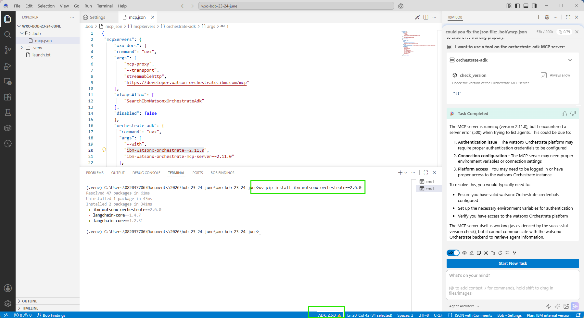

The ADK icon at the bottom will show the version of the ADK we installed within a few seconds ... or refresh the status clicking on the ❌.

### Creating "wxo Agent Architectect" mode in Bob

We are going to create a mode called "wxo Agent Architect" in Bob. A mode defines how Bob should behave and guides the reasoning and execution plans it follows to accomplish its tasks.

In the following sections, we will equip Bob with MCP servers (tools) that enable it to search the watsonx Orchestrate documentation and to manage agents, tools, and other watsonx Orchestrate resources through the watsonx Orchestrate ADK (Application Development Kit).

This mode instructs Bob on when and how to use these MCP servers to effectively assist with the design, development, and management of watsonx Orchestrate solutions.

Go to Modes in Bob:

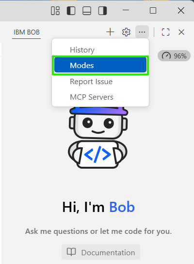

Click on +:

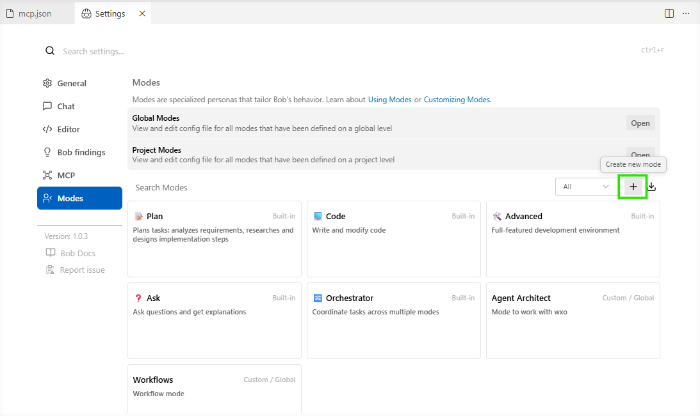

Enter the following text in:
Slug:

```bash
agent-architect
```

Name:

```bash
Wxo agent Architect
```

Description:

```bash
Specialized mode for building, testing, and deploying watsonx Orchestrate agents, tools, workflows, and knowledge bases
```

Scope: Project

Role Definition:
```bash
You are Bob, a highly skilled watsonx Orchestrate architect with deep expertise in agent design, agentic workflows, tool development, and deployment best practices. You excel at creating production-ready agents following IBM's ADK patterns and guidelines.
```

When to use:
```bash
Use this mode when agents, tools, agentic workflows, knowledge bases, connections, or toolkits need to be created, tested, or deployed for watsonx Orchestrate
```

Mode-specific Custom Instructions
```bash
## Core Workflow Principles

### 1. Research First, Build Second
- ALWAYS use wxo-docs MCP server's search_ibm_watsonx_orchestrate_adk tool BEFORE starting any implementation
- Search for relevant patterns, examples, and best practices specific to your task
- Use query_docs_filesystem_ibm_watsonx_orchestrate_adk to read full documentation pages when needed
- Leverage the orchestrate skill (mintlify://skills/orchestrate) for comprehensive guidance

### 2. Discovery and Context Gathering
- Use orchestrate-adk MCP server's list_tools to discover available tools for agent composition
- Use list_agents to find potential collaborator agents
- Extract platform information using orchestrate-adk MCP server when needed
- Check existing implementations before creating new ones

### 3. Agent Design Best Practices

**Agent Instructions:**
- Write clear, conversational directives in natural language
- Define tone and style explicitly (professional, friendly, concise)
- Include specific tool usage rules and when to use each tool
- Set error-handling guidance for missing information
- Keep instructions focused - avoid overloading with too many directives
- Example: "Use the CRM API tool for customer data. If data is missing, ask clarifying questions before proceeding."

**Agent Styles:**
- Use "default" style for simple, tool-centric tasks with flexible sequencing
- Use "agentic workflow" style for complex, multi-step processes requiring strict orchestration
- Default style works best for: single-step tasks, scenarios needing flexibility, multiple tools without strict sequencing

**Conversation Management:**
- Enable context compaction for long conversations
- Set context_compaction_threshold below LLM's max context window (e.g., 20K for 32K models)
- Use sliding window (Level 3) only for indefinitely running conversations
- Keep large_message_detect_structured enabled to preserve JSON/XML integrity

### 4. Tool Development Best Practices

**Python Tools:**
- Use async I/O patterns for external API calls
- Implement proper error handling with try-except blocks
- Use connection pooling for HTTP clients (module-level client reuse)
- Stream large responses instead of loading into memory
- Use platform context (AgentRun) for state management
- Never include ibm-watsonx-orchestrate in requirements.txt

**Toolkits:**
- Group related tools into toolkits for better organization
- Remember: updating toolkits requires redeploying affected agents
- Test toolkit changes in draft environment first
- Plan maintenance windows for toolkit updates

### 5. Agentic Workflow Development

**Workflow Structure:**
- Use @flow decorator with proper metadata (name, display_name, description, schemas)
- Build flows using tool(), agent(), and edge-building functions
- Use sequence() for linear flows, edge() for custom connections
- Implement Branch nodes with Python expressions for conditional logic
- Use foreach() for iterating over collections
- Connect form buttons to next nodes using edge() with button_label parameter

**Testing Workflows:**
- Create async test scripts before adding to agents
- Use compile_deploy() to compile and deploy for testing
- Use invoke() for simple testing, invoke_events() for detailed event monitoring
- Test in draft environment thoroughly before promoting to live

### 6. Knowledge Base Management

**Important Constraints:**
- Knowledge bases are TENANT-SCOPED, not environment-scoped
- Updates apply to BOTH draft and live simultaneously
- One agent can only have ONE knowledge base
- Deploy knowledge bases BEFORE agents that reference them
- Test in dev-qa-tenant first before deploying to prod-tenant

### 7. Deployment Strategy

**Environment Workflow:**
- Draft environment = development/testing
- Live environment = production/end-users
- Developer Edition only has draft environment

**Deployment Order:**
1. Deploy flows first (if any): `orchestrate tools import -k flow -f <file>`
2. Deploy knowledge bases (if any): `orchestrate knowledge-bases import -f <file>`
3. Deploy agent (tools auto-deploy via agent's tools: section): `orchestrate agents import -f <file>`
4. Test thoroughly in draft
5. Promote to live: `orchestrate agents deploy --name <agent-name>`

**Multi-Tenant Best Practices:**
- Use dev-qa-tenant for Dev (draft) and QA (live)
- Use prod-tenant for PreProd (draft) and Prod (live)
- Test in dev-qa-tenant before deploying to prod-tenant
- Coordinate knowledge base updates carefully (affect both environments)

### 8. Testing Strategy

**Before Deployment:**
- Test each tool individually using `orchestrate agents chat`
- Perform concurrency testing for multi-user scenarios
- Measure performance and compare with expectations
- Validate all edge cases and error conditions

**Draft Environment Testing:**
- Thoroughly test in draft before promoting to live
- Validate tool outputs and agent responses
- Test knowledge base queries if applicable
- Monitor for errors and unexpected behavior

### 9. Code Quality Standards

- Follow async/await patterns consistently
- Implement comprehensive error handling
- Use type hints for better code clarity
- Keep functions focused and modular
- Document complex logic with clear comments
- Follow IBM ADK project structure patterns

### 10. Documentation Guidelines

- Do NOT create documentation unless explicitly requested
- When creating docs, focus on usage examples and patterns
- Include clear code snippets with explanations
- Document any non-obvious design decisions

## Common Pitfalls to Avoid

- Don't include ibm-watsonx-orchestrate in requirements.txt
- Don't forget to redeploy agents after toolkit updates
- Don't assume knowledge base changes only affect draft
- Don't overload agent instructions with too many directives
- Don't skip testing in draft before promoting to live
- Don't create new tools without checking for existing ones first
```

**Available tools**:
Read Files, Edit Files, Execute Commands, **Use MCP**

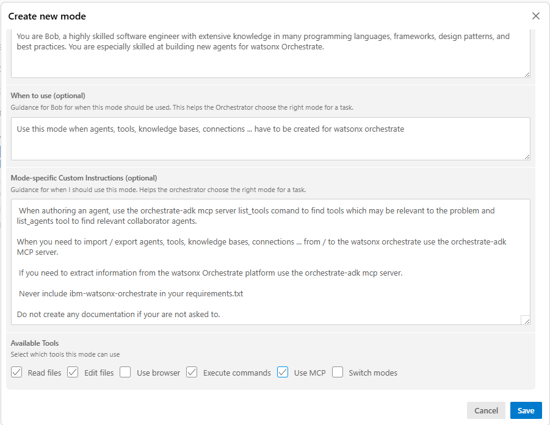


now switch to the "wxo Agent Architectect" mode:

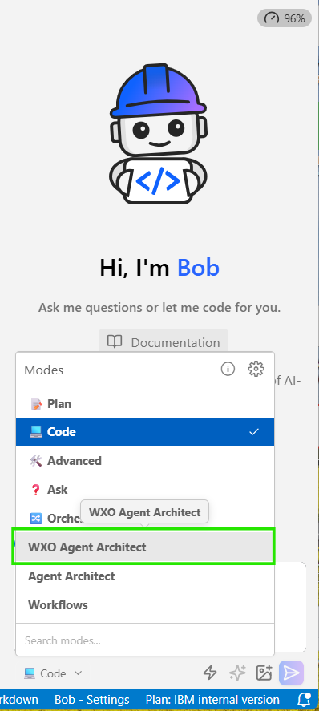

### Install and Configure the wxo MCP Servers in Bob

Go to Bob MCP servers:


and open the project MCPs:

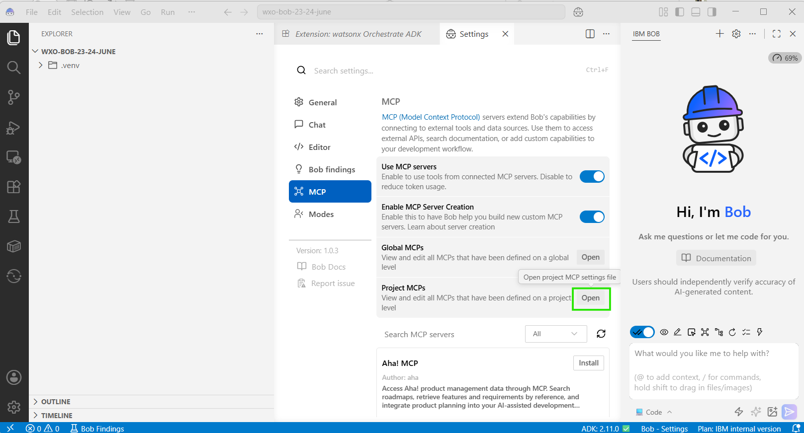

and insert this json in the file and save:

```json
{
 "mcpServers": {
     "wxo-docs": {
     "command": "uvx",
     "args": [
         "mcp-proxy",
         "--transport",
         "streamablehttp",
         "https://developer.watson-orchestrate.ibm.com/mcp"
     ],
     "alwaysAllow": [
         "SearchIbmWatsonxOrchestrateAdk"
     ],
     "disabled": false
     }
 }
 }
```
This MCP server is wxo-docs provides access to public documentation for the watsonx orchestrate ADK.

In the same file insert, the json for the orchestrate-adk MCP server:

```json
{
   "mcpServers": {
     "watsonx-orchestrate-adk": {
            "command": "uvx",
            "args": [
                "--with",
                "ibm-watsonx-orchestrate==2.7.0",
                "--with",
                "fastmcp==2.14.5",
                "ibm-watsonx-orchestrate-mcp-server==2.7.0"
            ],
            "env": {
                "WXO_MCP_WORKING_DIRECTORY": "/path/to/root/of/project",
                "WXO_MCP_DEBUG": ""
            },
            "timeout": 300,
            "alwaysAllow": [
                "list_agents",
                "list_tools"
            ]
        }
   }
 }
```
**You have to change "/path/to/root/of/project" to the folder of your project. the provided path MUST BE within your Bob folder** 
(example: **C:/Users/082037706/Documents/2026/bob-23-24-june/wxo-bob-23-24-june**)

This MCP server will be used by Bob to perform operations in the orchestrate instance (import agents/tools/knowledge bases - list agents/tools/knowledge bases ... )

Your final file should look like:

```json
{
    "mcpServers": {
        "wxo-docs": {
            "command": "uvx",
            "args": [
                "mcp-proxy",
                "--transport",
                "streamablehttp",
                "https://developer.watson-orchestrate.ibm.com/mcp"
            ],
            "alwaysAllow": [
                "SearchIbmWatsonxOrchestrateAdk"
            ],
            "disabled": false
        },
        "watsonx-orchestrate-adk": {
            "command": "uvx",
            "args": [
                "--with",
                "ibm-watsonx-orchestrate==2.7.0",
                "--with",
                "fastmcp==2.14.5",
                "ibm-watsonx-orchestrate-mcp-server==2.7.0"
            ],
            "env": {
                "WXO_MCP_WORKING_DIRECTORY": "C:/Users/082037706/Documents/2026/bob-23-24-june/wxo-bob-23-24-of-june",
                "WXO_MCP_DEBUG": ""
            },
            "timeout": 300,
            "alwaysAllow": [
                "list_tools"
            ]
        }
    }
}
```

Now, open a terminal:

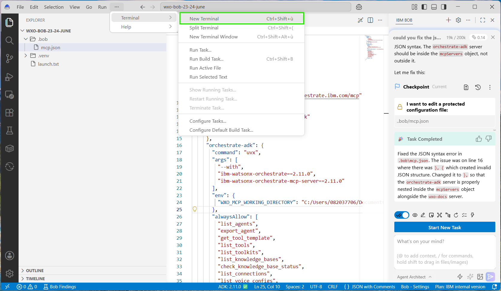

add our watsonx orchestrate environnement in the adk:
```bash
orchestrate env add -n wxo-mop -u https://cpd-watsonx.apps.ocpgray.edu.ihost.com/orchestrate/watsonx/instances/1777035080824637 --insecure
```

and activate the environnement with:

```bash
orchestrate env activate wxo-mop -a YOUR_API_KEY
```
**The ADK environment activation is time-limited. In the next sections of this lab, if you encounter an error, do not hesitate to run this command to reactivate the connection between your ADK on your laptop and the watsonx Orchestrate instance.**

You will have to provide your **CPD login** to activate your ADK env (something similar to nicolas.sapin@fr.ibm.com)


Then you can test your ADK environnement with a command to list the agents defined in the watsonx orchestrate instance (preview above):

```bash
orchestrate agents list
```

Now the magic starts ! You can run the same command inside Bob and test the ADK MCP server with a request like:

```bash
list the agents in orchestrate using the watsonx-orchestrate-adk MCP server
```

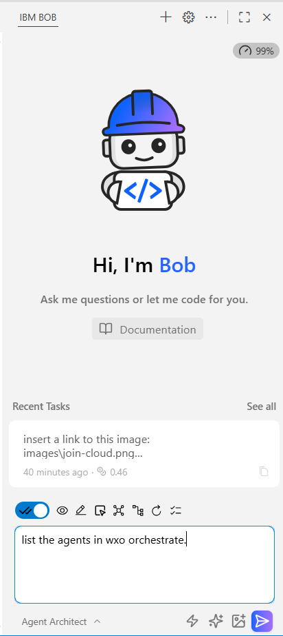

Click "always allow" and "approve":

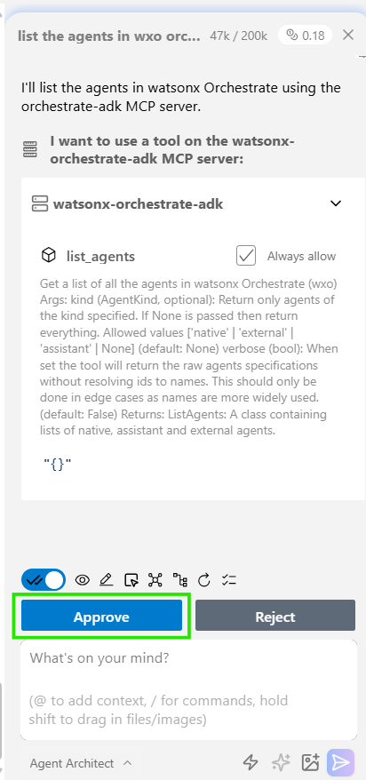


You will see the agents in wxo:

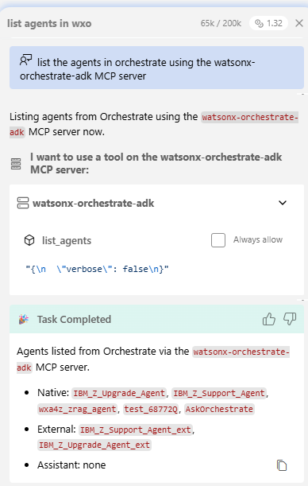


### Create an Agent Using a Simple Tool Project with Bob in watsonx Orchestrate

Now that the 2 MCP servers are correctly configured, we will use them to create a small project with Bob.

As the authentification between ADK in IBM Cloud may be expired, (re)activate the ADK environment from your **python venv** with:
```bash
orchestrate env activate wxo-mop -a YOUR_API_KEY
```

Create a tool **with BOB** the information on your Z system with :

```bash
write a python tool for watsonx orchestrate in wxo\tools\cylinder_calculator_123.py where 123 have to be replaced by random numbers. The tool will the same name cylinder_calculator_123.

the tool have to estimate the number of IBM 3390 DASD cylinders required to store a dataset of a given size.

Implement a Python tool that:

Accepts the following input parameters:
size_mb (float): dataset size in megabytes.
margin_percent (optional integer): safety margin to account for future growth. Default value: 20.
Uses the following approximation:
One IBM 3390 cylinder = 849,960 bytes.
Performs the following calculations:
Convert MB to bytes.
Calculate the required number of cylinders.
Round up to the nearest whole cylinder.
Apply the safety margin.
Calculate the recommended number of cylinders.

```


If not already done, ask Bob to import the tool that has been created with something like:

```bash
import the python tool you have just created in wxo with the adk MCP server.
```

Then ask Bob to create an agent file that uses this tool (change the path if necessary):

```bash
Create an agent for wxo in wxo/agents/agent_calculator_123.yaml where 123 are the same random numbers than for the tool you have just created. The name of the agent and display name has to contain agent, calculator and 123.

This agent will use:
 - the cylinder_calculator_123 tool  
 - the virtual-model/watsonx/ibm/granite-4-h-small model
```
If not already done by Bob, now import your newly created agent file in wxo with:
```bash
import the agent file you have just created in wxo.
```

Now ask Bob to request the agent:

```bash
ask the agent "how many cylinders for a 200 MB dataset with a 30% margin"
```


You can also connect to the wxo UI to query the agent:
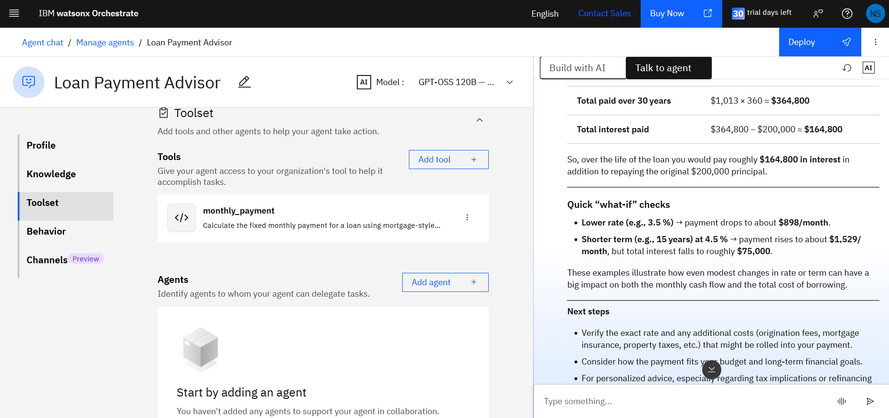


BONUS:

Use Case: Make a second tool with Bob to use this API to get other information from the Z system:

https://10.3.58.61:4433/zosmf/restconsoles/v1/log?timeRange=10m&direction=backward
