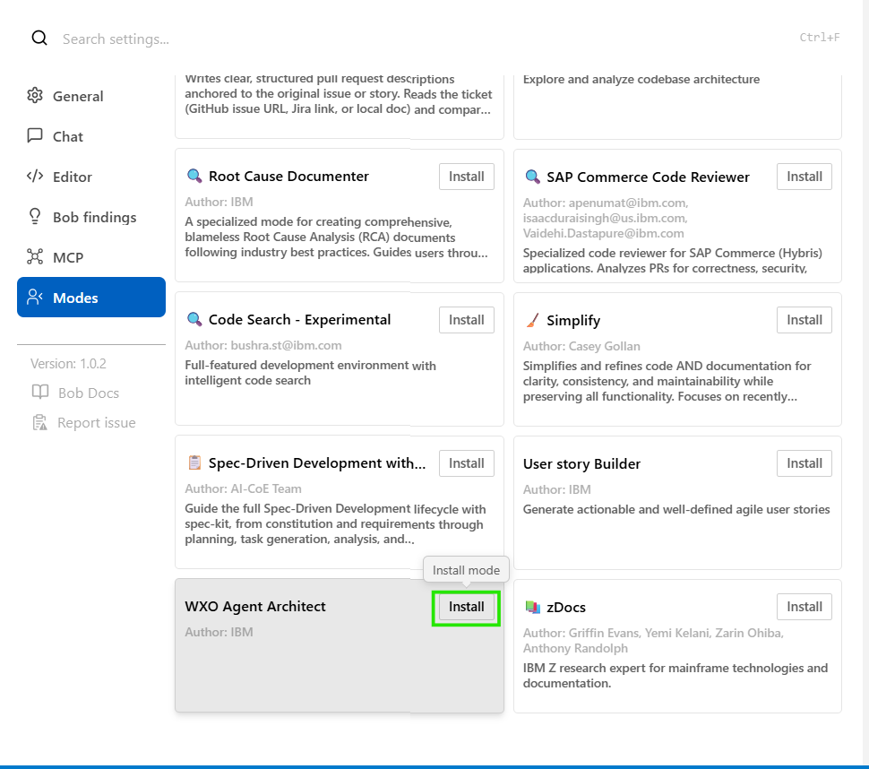
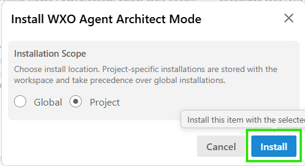

## Welcome to the Bob wxo MCP servers lab!

You will learn how to:
 - Install and configure watsonx Orchestrate ADK to interact with an wa4z instance
 - Configure Bob MCP servers to work with the wa4z instance from Bob
 - Create an agent using and a simple tool with Bob in watsonx Orchestrate
 - Load these agent and tool in the wa4z instance and run them.

### Prerequisites: Install wxo ADK

#### Connect the wa4z instance 

Connect your openvpn:


Another DNS server has to be added to resolve the wa4z instance:

For windows:

```powershell
Add-DnsClientNrptRule -Namespace ".ocpgray.edu.ihost.com" -DnsSecEnable -NameServers ("10.3.34.1")
```

For MAC ( NOT TESTED):
```bash
sudo mkdir -p /etc/resolver
echo "nameserver 10.3.34.1" | sudo tee /etc/resolver/ocpgray.edu.ihost.com
```

Open your browser and type this url:

```url
https://cpd-watsonx.apps.ocpgray.edu.ihost.com
```

select "OpenShift authentification" and click Continue:


then select "ldapShowcase":


type the provided username / password and click login:


Select instances the wxo:


then "Open" and you will be connected the watsonx orchestrate instance:


#### Install uv (if not already installed)

Have a look at [uv installation instructions](https://docs.astral.sh/uv/getting-started/installation/) or directly follow these instructions depending on your operating system.

**Windows:**
To install uv on Windows, open PowerShell or Command Prompt and run:
```powershell
powershell -ExecutionPolicy ByPass -c "irm https://astral.sh/uv/install.ps1 | iex"
```


**Mac:**
To install uv on Mac, open Terminal and run:
```bash
curl -LsSf https://astral.sh/uv/install.sh | sh
```


After installation, verify uv is installed correctly by running:
```bash
uv --version
```


#### Install ADK

- Open New Window (Ctrl + Shift + N) within Bob IDE to start from a clean workspace.

- Create and Open a new folder for your project (name it properly, here we use the folder named environment-setup just as an example)


Here the folder is "wxo-bob-23-24-june":


 - Click the search bar on the top and select Show and Run Commands
 


 - Type in “create” and select Python: Create Environment…
 


 - Select Venv if given some options (depends on what you have installed to your computer)
 
 

 - Select your Python installation, 3.11.x – 3.13.x (3.12.9 recommended - the current ADK requires Python 3.11 or later; anything older than 3.11 is not supported for installation)
 


The Python virtual environment will be installed and you’ll see the .venv folder under your project folder in a couple of seconds.

## NOT SURE TO DO THAT PART
**Rename it to venv** (this is because the wxO extensions default setting)


## END OF NOT SURE TO DO THAT PART

 - Click the Extensions icon from the menu bar on the left, search for “watsonx” and click Install on the watsonx Orchestrate ADK extension


This will install the extension (note that the extension is still in preview)

Now that you have the wxO ADK extension installed, you can see the ADK information on the bottom right of Bob IDE window.

Hoover the ADK: ❌ – **BUT DO NOT INSTALL THE ADK VIA THE UI** (We want to install a specific version of the ADK because the latest version has a bug related to watsonx Orchestrate on-prem that we want to avoid.)


Open a terminal. The Python virtual environment you recently created should now be activated.:


Install the ADK python package with:

```bash
pip install ibm-watsonx-orchestrate==2.6.0 ibm-watsonx-orchestrate-clients==2.7.0 ibm-watsonx-orchestrate-core==2.7.0
```


The ADK icon at the bottom will show the version of the ADK we installed within a few seconds ... or refresh the status clicking on the ❌.

### TO BE UPDATED: Installing "wxo Agent Architectect" in Bob

Go to Modes in Bob:


Scroll down and install the "wxo Agent Architectect" mode:





now switch to the "wxo Agent Architectect" mode:


### Install and Configure the wxo MCP Servers in Bob

Go to Bob MCP servers:


and open the project MCPs:


and insert this json in the file and save:

```json
{
 "mcpServers": {
     "wxo-docs": {
     "command": "uvx",
     "args": [
         "mcp-proxy",
         "--transport",
         "streamablehttp",
         "https://developer.watson-orchestrate.ibm.com/mcp"
     ],
     "alwaysAllow": [
         "SearchIbmWatsonxOrchestrateAdk"
     ],
     "disabled": false
     }
 }
 }
```
This MCP server is wxo-docs provides access to public documentation for the watsonx orchestrate ADK.

In the same file insert, the json for the orchestrate-adk MCP server:

```json
{
   "mcpServers": {
     "watsonx-orchestrate-adk": {
            "command": "uvx",
            "args": [
                "--with",
                "ibm-watsonx-orchestrate==2.7.0",
                "--with",
                "fastmcp==2.14.5",
                "ibm-watsonx-orchestrate-mcp-server==2.7.0"
            ],
            "env": {
                "WXO_MCP_WORKING_DIRECTORY": "/path/to/root/of/project",
                "WXO_MCP_DEBUG": ""
            },
            "timeout": 300,
            "alwaysAllow": [
                "list_agents",
                "list_tools"
            ]
        }
   }
 }
```
**You have to change "/path/to/root/of/project" to the folder of your project. the provided path MUST BE within your Bob folder** 
(example: **C:/Users/082037706/Documents/2026/bob-23-24-june/wxo-bob-23-24-june**)

This MCP server will be used by Bob to perform operations in the orchestrate instance (import agents/tools/knowledge bases - list agents/tools/knowledge bases ... )

Your final file should look like:

```json
{
    "mcpServers": {
        "wxo-docs": {
            "command": "uvx",
            "args": [
                "mcp-proxy",
                "--transport",
                "streamablehttp",
                "https://developer.watson-orchestrate.ibm.com/mcp"
            ],
            "alwaysAllow": [
                "SearchIbmWatsonxOrchestrateAdk"
            ],
            "disabled": false
        },
        "watsonx-orchestrate-adk": {
            "command": "uvx",
            "args": [
                "--with",
                "ibm-watsonx-orchestrate==2.7.0",
                "--with",
                "fastmcp==2.14.5",
                "ibm-watsonx-orchestrate-mcp-server==2.7.0"
            ],
            "env": {
                "WXO_MCP_WORKING_DIRECTORY": "C:/Users/082037706/Documents/2026/bob-23-24-june/wxo-bob-23-24-of-june",
                "WXO_MCP_DEBUG": ""
            },
            "timeout": 300,
            "alwaysAllow": [
                "list_tools"
            ]
        }
    }
}
```

Now, open a terminal:


add our watsonx orchestrate environnement in the adk:
```bash
orchestrate env add -n wxo-mop -u https://cpd-watsonx.apps.ocpgray.edu.ihost.com/orchestrate/watsonx/instances/1777035080824637 --insecure
```

and activate the environnement with:

```bash
orchestrate env activate wxo-mop -a 7ziDAsScYfnxbkDyInjcAKKXRaKwT8wNXTWJScaP
```
**The ADK environment activation is time-limited. In the next sections of this lab, if you encounter an error, do not hesitate to run this command to reactivate the connection between your ADK on your laptop and the watsonx Orchestrate instance.**

You will have to provide your **CPD login** to activate your ADK env (something similar to nicolas.sapin@fr.ibm.com)


Then you can test your ADK environnement with a command to list the agents defined in the watsonx orchestrate instance (preview above):

```bash
orchestrate agents list
```

Now the magic starts ! You can run the same command inside Bob and test the ADK MCP server with a request like:

```bash
list the agents in orchestrate using the watsonx-orchestrate-adk MCP server
```


Click "always allow" and "approve":


You will see the agents in wxo:


### Create an Agent Using a Simple Tool Project with Bob in watsonx Orchestrate

Now that the 2 MCP servers are correctly configured, we will use them to create a small project with Bob.

As the authentification between ADK in IBM Cloud may be expired, (re)activate the ADK environment from your **python venv** with:
```bash
orchestrate env activate wxo-mop -a 7ziDAsScYfnxbkDyInjcAKKXRaKwT8wNXTWJScaP
```

Create a tool **with BOB** that performs a loan calculation (change the path wxo-files/tools/loan_tool.py according to your project - it has to be visible by the ADK MCP server):

```bash
Write a Python tool for IBM watsonx Orchestrate that exposes a single function:

def monthly_payment(principal: float, annual_rate: float, years: int) -> float:
    ...
Functional requirements:

The function calculates the fixed monthly payment for a loan (mortgage-style amortization).

Parameters:

principal: total loan amount (float).

annual_rate: annual interest rate in percent (e.g. 4.5 for 4.5%).

years: loan duration in years (integer).

Use the standard amortization formula with monthly compounding.

Correctly handle the edge case where annual_rate is 0 (no interest).

Return the monthly payment as a float rounded to 2 decimal places.

Raise a clear error (ValueError) for invalid inputs (negative or zero principal, non-positive years, negative rate).

Code and structure requirements:

Use only the Python standard library (no external dependencies).

Add type hints and concise docstrings.

Organize the code as a watsonx Orchestrate tool:

Place the implementation in wxo-files/tools/loan_tool_XXXX.py where you have to replace XXXX with your own unique identifier. the name of the tool should be loan_tool_XXXX.

The file must define the monthly_payment function as the main callable entry point.
```


Now ask Bob to import the tool that has been created with something like:

```bash
import the python tool you have just created in wxo.
```

Then ask Bob to create an agent file that uses this tool (change the path if necessary):

```bash
create an agent file in wxo-files\agents\loan_advisor_agent_XXXX.yaml directory.  this agent have to use the loan_tool tool you have just created to provide information about loan payments. The name and the display name of the agent file should be loan_advisor_agent_XXXX where you have to replace XXXX with your own unique identifier. The agent should be able to answer questions about loan payments and provide the monthly payment amount for a given loan amount, interest rate, and term. The agent should be able to handle edge cases and provide clear error messages. The agent should be able to be imported in wxo.

```
Now import your newly created agent file in wxo with:
```bash
import the agent file you have just created in wxo.
```

Get the ID of your agent and use it to configure the 3rd MCP server:

```bash
What is the agent ID of the loan advisor agent you have just imported in wxo ?
```


Restart the MCP server:


Now ask Bob to request the agent:

```bash
What would my monthly payment be for a $200,000 mortgage at 4.5% for 30 years?
```

And you can ask to get the logs from the last execution with the next command, it could be interesting to get these logs if there are errors during the agent request execution:

```bash
get the logs from the execution of the loan advisor agent.
```

You can also connect to the wxo UI to query the agent:


BONUS:

Use Case: Currency Converter Agent

Objective

Create a helpful Currency Converter Agent that can instantly convert any amount between world currencies (e.g. “Convert 250 EUR to USD” or “What is 1500 GBP in JPY?”).
What you will build

A Python tool (currency_converter_tool.py) that calls the free Frankfurter API (no API key required)
An agent (currency_converter_agent.yaml) that uses this tool

Your mission

Ask Bob to create the Python tool that contains a function convert_currency(amount, from_currency, to_currency).

Ask Bob to create the agent file that uses this tool.

Import both the tool and the agent into watsonx Orchestrate using the ADK MCP server (same method as the loan calculator).

Test your agent by asking Bob or the watsonx Orchestrate UI questions like:

“Convert 500 EUR to USD”

“How much is 1200 GBP in CAD?”